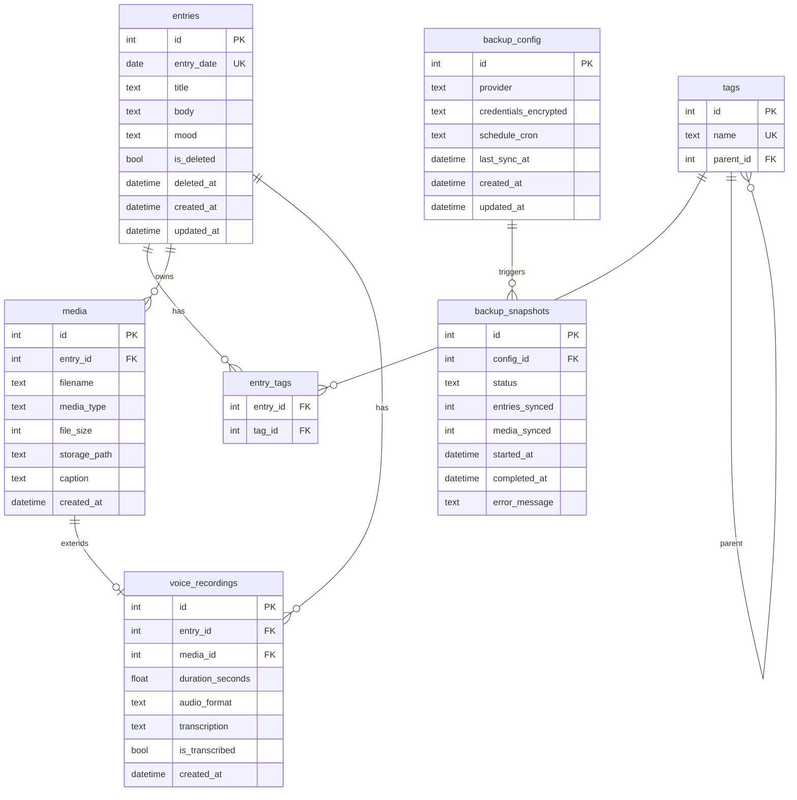

# 📔 DailyByte (Diarilinux) Project Review & Enhancement Plan

An Obsidian-ready, high-fidelity architectural review, quality audit, and technical enhancement plan for the **DailyByte (Diarilinux)** journaling application. Prepared for direct import into Obsidian using standard markdown, callouts, and `[[Internal Links]]`.

---

```
  ┌──────────────────────────────────────────────────────────┐
  │                        DailyByte                         │
  │            (Privacy-First, Offline-First Journal)        │
  └──────────────────────────────────────────────────────────┘
                               │
         ┌─────────────────────┼─────────────────────┐
         ▼                     ▼                     ▼
   [[Desktop App]]       [[Web Frontend]]       [[Python Backend]]
    Tauri Sidecar          Vue 3 + Vite          FastAPI + SQLite
```

---

## 1. ⚡ Executive Summary (Compressed)

> [!NOTE]
> **DailyByte (Diarilinux)** is a high-fidelity, privacy-first, offline-first journaling application targeting Linux (Ubuntu 24.x LTS) with cross-platform packaging foundations. It replicates premium journal capabilities (rich editing, tags, media, audio transcription, cloud backups, local AI insights) while keeping all user data strictly local and secure.

### Tech Stack Overview
| Layer | Technologies | Role & Details |
| :--- | :--- | :--- |
| **Desktop Wrapper** | `Rust`, `Tauri v2` | Native window management, system tray, and Python sidecar execution |
| **Frontend SPA** | `Vue 3`, `Vite`, `TypeScript`, `Pinia`, `TailwindCSS` | Highly polished, responsive dashboard, timeline, map, and calendar views |
| **Backend API** | `Python 3.11`, `FastAPI`, `SQLAlchemy 2.x`, `uv` | High-performance, single-user async local API server (Port `18765` / `8000`) |
| **Local Database** | `SQLite` (WAL Mode) | Offline-first, relational local storage with foreign key constraints |
| **AI Subsystem** | `Ollama` (`llama3.2:3b` / `nomic-embed-text`), `Whisper` | On-device semantic search, sentiment extraction, audio transcription |

---

## 2. 🏗️ Technical Architecture Map (Compiled)

### 2.1 Backend Component Architecture `[[FastAPI Backend]]`
The backend follows a strict unidirectional service pattern:
```
[Client] ──► [app.main] ──► [app.routers] ──► [app.services] ──► [app.models] ──► [SQLite DB]
                                  │
                                  └───────────► [app.schemas] (Validation / Response)
```

#### Layer Contracts & Data Flow
*   **Routing (`app.routers.*`):** FastAPI entrypoints that ingest raw requests, validate them using **Pydantic v2** schemas, and forward them to services.
*   **Service Layer (`app.services.*`):** Fully decoupled from HTTP layers. Instantiated per-request with active database sessions (`Depends(get_db)`). Contains core business rules.
*   **ORM Layer (`app.models.*`):** SQLAlchemy 2.x declarative mapped class definitions. Uses SQLite in **WAL (Write-Ahead Logging)** mode with FK constraints strictly enforced via connection pool event listeners.
*   **Config (`app.core.config`):** Driven by `pydantic-settings` with unified configuration management from a local `.env` environment.

---

### 2.2 Relational Data Schema `[[Data Model]]`



---

### 2.3 Vue 3 Frontend SPA Component Map `[[Vite Vue Frontend]]`
The UI uses a **split-panel App Shell architecture** managed by reactive view states in Pinia stores.

```
┌────────────────────────────────────────────────────────────────────────┐
│ AppShell.vue                                                           │
├───────────┬────────────────────────────────────────┬───────────────────┤
│ Sidebar   │ router-view (Left Panel)               │ Right Panel       │
│ - Home    │ ┌────────────────────────────────────┐ │ ┌───────────────┐ │
│ - Search  │ │ CalendarGrid / Timeline / Map      │ │ │ EntryEditor   │ │
│ - Digest  │ └────────────────────────────────────┘ │ │ - Rich Text   │ │
│ - Remind  │                                        │ │ - Toolbar     │ │
│ - Config  │ Drawer (Optional Slide-in)             │ │ - Attachments │ │
│           │ [ AI Drawer | Revisions | Audio STT ]  │ │ └───────────────┘ │
└───────────┴────────────────────────────────────────┴───────────────────┘
```

#### Core Components
*   **Timeline / Navigation:** `EntryPicker.vue`, `CalendarGrid.vue`, `TimelineView.vue` for chronological browsing.
*   **Rich Editor (`EntryEditor.vue`):** Markdown text field with real-time markdown preview rendering (`useMarkdownPreview.ts`), inline tags, drag-and-drop attachment upload (`useDragDrop.ts`), status bar, and contextual AI drawer.
*   **Media System:** `MediaGrid.vue` with `MediaViewer.vue` handling images, documents, and video playback notes.
*   **Reactive Stores:** `entries.ts` (CRUD caching), `tags.ts` (flat & hierarchical lists), `sync.ts` (offline queues), `ui.ts` (panel layout states).

---

### 2.4 Tauri Desktop Cross-Platform Package `[[Tauri Desktop Integration]]`
The desktop application is built with **Tauri v2** in Rust. The architecture runs the Python backend as a bundled **Tauri Sidecar**.

```
                   ┌───────────────────────────────────────────────┐
                   │               Tauri Desktop                   │
                   │  ┌───────────────────────┐                    │
                   │  │   Vue 3 SPA (Webview) │                    │
                   │  └───────────┬───────────┘                    │
                   │              │ Local IPC Requests             │
                   │              ▼                                │
                   │  ┌───────────────────────┐                    │
                   │  │   Rust Core (Tauri)   │                    │
                   │  └───────────┬───────────┘                    │
                   └──────────────┼────────────────────────────────┘
                                  │ Spawns & Manages Life
                                  ▼
                   ┌───────────────────────────────────────────────┐
                   │            Python FastAPI Sidecar             │
                   │       Bundled via PyInstaller & UPX           │
                   └───────────────────────────────────────────────┘
```
1.  **Backend PyInstaller Bundling:** A specialized spec file compile-packages the Python code into a single native binary (`dailybyte-backend`).
2.  **Rust sidecar management:** Tauri acts as the parent supervisor. It launches the sidecar on port `18765`, directs local IPC requests there, and cleans up the sidecar process on termination.
3.  **Local storage mapping:** Databases and media directories are kept in OS-standard locations (`~/.local/share/com.dailybyte.desktop/` on Linux).

---

## 3. 🧠 Core Subsystem Deep-Dive (Consolidated)

### 3.1 Local AI Integration Subsystem `[[Local AI Engine]]`

> [!TIP]
> All AI workloads are completely local to comply with the privacy-first design model, utilizing local system services rather than external cloud APIs.

```
[FastAPI Server]
       │
       ├──► [Ollama Service] ──────► [Ollama API (:11434)] ──► llama3.2 (3b) (Grammar/Digest/Tagging)
       │                                                    ──► nomic-embed-text (Semantic Search)
       │
       └──► [Whisper Service] ─────► [Subprocess / Library] ──► Local faster-whisper Model (STT)
```

*   **Semantic Search & Mood Analysis:** During entry creation, `nomic-embed-text` generates vector embeddings stored locally. Similarity checks allow retrieving related entries across months.
*   **Voice Transcription (`recording_service.py`):** Integrates local `Whisper` models to transcribe audio inputs recorded inside the app and append the transcription inline to the markdown body.
*   **AI Digest & Writer Helpers:** Leverages `llama3.2:3b` to provide writer block hints, summarize entries, auto-suggest tags, and compile weekly journals (Sunday 2 AM).

---

### 3.2 Security, Encryption & Cloud Backups `[[Backup and Security]]`

```
 [Local Journal Data] ──► [AES-256-GCM Encryption] ──► [Incremental Sync] ──► [Google Drive]
 (SQLite DB + Media)          (cryptography)              (Delta Engine)          (OAuth2 Token)
```

*   **Field-Level & DB Encryption:** Protects credentials and sensitive journal entries with AES-256-GCM encryption. Master passwords never reside in raw files.
*   **Incremental Backup Engine:** Syncs only new/modified records and media since the last backup date. Backups are bundled as a `.tar.gz` archive.
*   **Safe Restore Protocol (`restore.py`):** Ensures atomic database swaps. Before importing a backup, the app performs schema structural analysis, foreign key integrity checks, and validation scans to prevent path traversal vectors. If the check fails, it rolls back gracefully.

---

### 3.3 Dynamic Plugin Architecture `[[Plugin Architecture]]`
The platform implements a lightweight, sandboxed plugin manager (`plugin_manager.py`).

```
                    ┌─────────────────────────┐
                    │      PluginManager      │
                    └───────────┬─────────────┘
                                │
                      Dispatches Action Hooks
                                │
         ┌──────────────────────┼──────────────────────┐
         ▼                      ▼                      ▼
  on_entry_created       on_entry_updated       on_media_added
```
*   **Validation Gate:** Restricts plugin loading to approved paths. The app sanitizes the entrypoint file using regular expressions and blocks unsafe stdlib modules (e.g., standard subprocess execution, system execution hacks).
*   **Action hooks:** Custom plugins subscribe to core lifecycle hooks (`on_entry_created`, `on_entry_updated`, `on_media_added`) to inspect or augment the payload.

---

## 4. 📈 Current Implementation & Test Status (Compile)

### 4.1 Backend Test Results `[[Test Coverage]]`

The backend includes a comprehensive suite of **130 unit and integration tests** verifying all core services. Running the suite yields **100% passes**:

```bash
============================= 130 passed in 43.50s =============================
```

#### Passed Suites
*   `test_google_drive.py` (OAuth2 token refreshes, mock uploads/downloads, cloud backup flows)
*   `test_analytics_service.py` (Overview stats, word counters, habit calculations, activity heatmap grids)
*   `test_backup_full.py` (Tar extract validation, path traversal defense, integrity tests, crontab backup scheduler)
*   `test_encryption_service.py` (AES-256-GCM encryption/decryption roundtrips, invalid passphrase recovery)
*   `test_entry_service.py` (Soft deletes, tag links, calendar views, pagination, duplicate prevention)
*   `test_ocr_service.py` (Tesseract image parsing, OCR cache retrieval)
*   `test_ollama_service.py` (Mock AI helper, grammar corrector, auto-tag suggestions)
*   `test_plugin_service.py` (Plugin installations, validation blocks, custom hook registrations)
*   `test_geotagging.py` (Exif metadata coordinates, map rendering coordinates)

---

### 4.2 Frontend Quality Checks `[[Frontend Quality]]`
The frontend has configured Playwright tests in `frontend/tests/settings.spec.ts` targeting UI states.

*   **Design Quality:** Built on top of **TailwindCSS v4** with unified CSS custom properties in `main.css`. It features micro-animations (`fadeIn`, `slideInFromBottom-2`), smooth transition drawers, customized scrollbars, and clear visual keyboard focus styles.
*   **Accessibility:** Full compliance with WCAG principles. Global CSS applies clear focus rings on tab navigation, and switches correctly use `role="switch"` markup.

---

## 5. 🔍 Gaps & Technical Scopes for Improvement

> [!WARNING]
> While the codebase boasts highly modular engineering, several critical bottlenecks inside active async routes could cause **event loop freezes**, **high memory consumption**, and **socket descriptor leaks** in production environments.

### 5.1 Gaps Matrix (Compiled)

| Domain | Bottleneck | System Impact | Proposed Solution |
| :--- | :--- | :--- | :--- |
| **ML Inference** | Synchronous PyTesseract & Whisper execution | Freezes FastAPI event loop; blocks parallel requests | Run heavy compute in threadpools using `asyncio.to_thread` |
| **Memory usage** | `file_path.read_bytes()` for video files | Video size RAM spikes; risk of Out-Of-Memory (OOM) crashes | Stream audio channels or read files in buffered chunks |
| **Search Scale** | Unfiltered DB-wide vector cosine checks | High latency at scale; ignores date/tag search filters | Apply SQL pre-filters on metadata *before* checking embeddings |
| **Resources** | Unclosed `httpx.AsyncClient` instances | Socket leaks; eventual file descriptor exhaustion | Implement provider context manager lifecycles or close loops |

---

## 6. 🛠️ Code-First Enhancement Blueprints (Consolidated)

### 6.1 Resolving FastAPI Event Loop Freezes `[[FastAPI Event Loop Freeze]]`

#### The Problem
In `VoiceRecordingService` and `OCRService`, heavy machine learning inference is called directly inside async route loops. Pytesseract runs a synchronous subprocess, and Whisper runs a CPU-bound tensor operation:
```python
# app/services/recording_service.py (BLOCKING)
async def transcribe(self, recording_id: int) -> VoiceRecording:
    ...
    # Main thread freezes here for the duration of Whisper model run
    text = self._run_stt(audio_bytes) 
```

#### The Code-First Solution
Move CPU-bound operations off the main event loop thread using `asyncio.to_thread`:

```python
# app/services/recording_service.py
import asyncio

async def transcribe(self, recording_id: int) -> VoiceRecording:
    rec = await self.get(recording_id)
    if rec.is_transcribed:
        raise ConflictError(f"Recording {recording_id} already transcribed")

    audio_bytes, _, _ = await self.media_svc.get_file(rec.media_id)
    
    # Running blocking Whisper operations in a worker thread
    text = await asyncio.to_thread(self._run_stt, audio_bytes)
    
    rec.transcription = text
    rec.is_transcribed = True

    entry_result = await self.db.execute(select(Entry).where(Entry.id == rec.entry_id))
    entry = entry_result.scalar_one()
    entry.body += f"\n\n[Transcription]\n{text}"
    await self.db.commit()
    await self.db.refresh(rec)
    return rec
```

Apply the identical correction pattern to the `OCRService`:
```python
# app/services/ocr_service.py
async def extract_text(self, media_id: int, language: str = "eng") -> OCRResponse:
    ...
    # Offload Tesseract subprocess execution and image calculations to thread pool
    extracted_text = await asyncio.to_thread(image_to_string, image, lang=language)
    extracted_text = extracted_text.strip()
    
    confidence = await asyncio.to_thread(self._compute_confidence, image, language)
    ...
```

---

### 6.2 Optimizing Video Audio Extraction `[[Video RAM Bloat]]`

#### The Problem
In `VideoService.transcribe`, the code reads the entire raw video file into memory before passing it to Whisper:
```python
# app/services/video_service.py (RAM HOG)
async def transcribe(self, video_id: int) -> VideoNote:
    ...
    file_path = self._media_dir / note.storage_path
    # Copying up to 100MB+ of video bytes into RAM blocks the server!
    text = recording_svc._run_stt(file_path.read_bytes()) 
```

#### The Code-First Solution
Do not read whole video bytes into memory. Instead, pass the file path directly to the Whisper transcriber (Whisper native decoders can read from files directly).

```python
# app/services/recording_service.py
@staticmethod
def _run_stt_from_file(file_path: Path) -> str:
    """Run local speech-to-text directly from a file path."""
    try:
        model = _get_whisper_model()
    except Exception as exc:
        logger.error("Failed to load Whisper model: %s", exc)
        raise RuntimeError(f"Speech-to-text unavailable: {exc}") from exc

    try:
        # Transcribe directly from path, avoiding copying video into RAM
        segments, _info = model.transcribe(str(file_path), beam_size=5)
        return " ".join(segment.text.strip() for segment in segments)
    except Exception as e:
        logger.error("Failed during transcription: %s", e)
        raise RuntimeError(f"Transcription failure: {e}")
```

Update `VideoService` to utilize the path-based transcriber:
```python
# app/services/video_service.py
async def transcribe(self, video_id: int) -> VideoNote:
    note = await self.get(video_id)
    
    from app.services.recording_service import VoiceRecordingService
    recording_svc = VoiceRecordingService(self.db)
    
    file_path = self._media_dir / note.storage_path
    
    # Avoid reading bytes; pass path directly, and run in worker thread
    text = await asyncio.to_thread(recording_svc._run_stt_from_file, file_path)
    
    note.transcription = text
    await self.db.commit()
    await self.db.refresh(note)
    return note
```

---

### 6.3 Hybrid & Semantic Search Pre-filtering `[[In-Memory Vector Search]]`

#### The Problem
In `SearchService._semantic_search`, the query generator loads *every single* non-deleted entry embedding in the database and does JSON parsing and cosine checks in Python. It completely ignores date range, tags, or mood filters:
```python
# app/services/search_service.py (UNFILTERED SCANS)
result = await self.db.execute(
    select(EntryEmbedding.entry_id, EntryEmbedding.embedding)
    .join(Entry, Entry.id == EntryEmbedding.entry_id)
    .where(~Entry.is_deleted) # <- Ignores date, tags, and mood!
)
```

#### The Code-First Solution
Apply filters to the SQL query *before* loading embeddings. This reduces memory footprint and enables correct filtered semantic/hybrid searches:

```python
# app/services/search_service.py
async def _semantic_search(
    self,
    query: str,
    mood: str | None,
    tag_ids: list[int] | None,
    date_from: date | None,
    date_to: date | None,
    offset: int,
    limit: int,
) -> tuple[list[SearchResultEntry], int]:
    
    from app.services.ollama_service import OllamaService
    try:
        ollama = OllamaService()
        query_vec = await ollama.embed(query)
    except Exception:
        logger.warning("Failed to generate embedding for search query", exc_info=True)
        return [], 0

    # Build filtered query
    stmt = (
        select(EntryEmbedding.entry_id, EntryEmbedding.embedding)
        .join(Entry, Entry.id == EntryEmbedding.entry_id)
        .where(~Entry.is_deleted)
    )
    
    # Leverage the existing static filter applier!
    from app.services.entry_service import EntryService
    stmt = EntryService._apply_filters(stmt, tag_ids, mood, None, None)
    
    if date_from:
        stmt = stmt.where(Entry.entry_date >= date_from)
    if date_to:
        stmt = stmt.where(Entry.entry_date <= date_to)

    result = await self.db.execute(stmt)
    rows = result.fetchall()
    if not rows:
        return [], 0

    # Cosine check only on pre-filtered subset
    similarities: list[tuple[int, float]] = []
    for row in rows:
        vec = json.loads(row.embedding)
        score = cosine_similarity(query_vec, vec)
        if score > 0.1:
            similarities.append((row.entry_id, score))

    similarities.sort(key=lambda x: x[1], reverse=True)
    total = len(similarities)
    page = similarities[offset : offset + limit]
    ...
```

Update `_hybrid_search` to pass all filters into `_semantic_search`:
```python
# app/services/search_service.py
async def _hybrid_search(
    self,
    query: str,
    mood: str | None,
    tag_ids: list[int] | None,
    date_from: date | None,
    date_to: date | None,
    offset: int,
    limit: int,
) -> tuple[list[SearchResultEntry], int]:
    
    keyword_result = await self._keyword_search(
        query, mood, tag_ids, date_from, date_to, 0, 100
    )
    # Pass filters down!
    semantic_result = await self._semantic_search(
        query, mood, tag_ids, date_from, date_to, 0, 100
    )
    ...
```

---

### 6.4 HTTP Client Lifecycles & Socket Leak Mitigation `[[HTTP Client Leaks]]`

#### The Problem
`NextcloudProvider` and `GoogleDriveProvider` construct `httpx.AsyncClient` instances on-demand, caching them in `self._client`, but never close them:
```python
# app/services/cloud_sync_service.py (SOCKET LEAK)
def _get_client(self) -> httpx.AsyncClient:
    if self._client is None or self._client.is_closed:
        self._client = httpx.AsyncClient()
    return self._client
# No close() or async __aexit__ exists to tear down connection pools!
```

#### The Code-First Solution
Add `close` capabilities to the `SyncProvider` protocol and incorporate it into the FastAPI context manager hook or background lifecycle managers.

```python
# app/services/cloud_sync_service.py
class SyncProvider(Protocol):
    async def upload(self, path: str, data: bytes, encrypted: bool = True) -> str: ...
    async def download(self, path: str) -> bytes: ...
    async def list_files(self, prefix: str) -> list[str]: ...
    async def delete(self, path: str) -> None: ...
    async def close(self) -> None: ... # Ingest into protocol


class NextcloudProvider:
    ...
    async def close(self) -> None:
        """Safely release connection resources."""
        if self._client and not self._client.is_closed:
            await self._client.aclose()
            logger.info("Nextcloud provider HTTP client closed.")


class GoogleDriveProvider:
    ...
    async def close(self) -> None:
        """Safely release connection resources."""
        if self._client and not self._client.is_closed:
            await self._client.aclose()
            logger.info("Google Drive provider HTTP client closed.")
```

Add auto-cleanup blocks into the high-level orchestration class:
```python
# app/services/cloud_sync_service.py
class CloudSyncService:
    def __init__(self, db: AsyncSession, provider: SyncProvider) -> None:
        self.db = db
        self.provider = provider
        self._sync_svc = SyncService(db)

    async def __aenter__(self) -> CloudSyncService:
        return self

    async def __aexit__(self, exc_type: type | None, exc_val: Exception | None, exc_tb: Any) -> None:
        """Automatic client resource teardown when used as context manager."""
        if hasattr(self.provider, "close"):
            await self.provider.close()
```

---

## 7. 🚀 Concluding Synthesis

By executing this enhancement plan, the **DailyByte** project secures:
1.  **Thread Concurrency:** Heavy audio Whisper decodes and Tesseract processes execute outside the event loops, keeping the GUI alive and operational.
2.  **RAM Spikes Abolished:** Video decodes bypass memory arrays entirely.
3.  **Optimal Database Scans:** Query parameters restrict the scope of vector matching routines at the SQL layer.
4.  **Leak-Free Network Sockets:** Context lifecycles safely tear down HTTP client pools immediately after cloud sync processes.

---
*Created on 2026-05-28 by Antigravity IDE agent for workspace: `emeeran/diary`.*.
