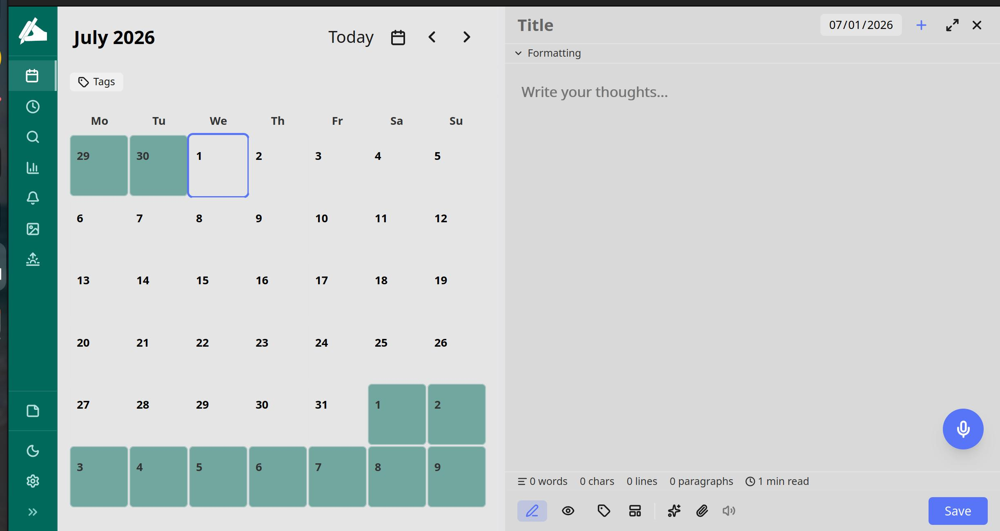
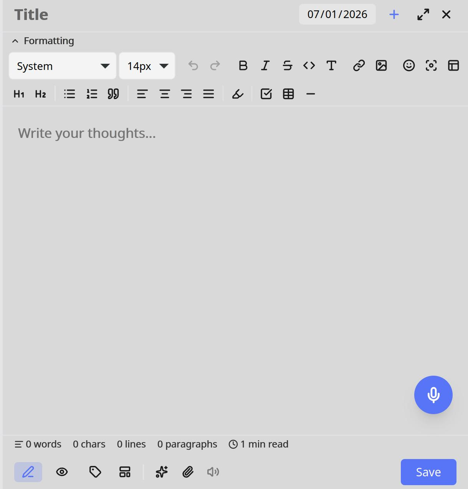

# 📔 LifeLogr

**Privacy-first, offline-first journaling for Linux.** A single-user, local-first app for daily journaling, rich notes, tasks, contacts, and email — with on-device AI (Ollama), OCR (Tesseract), read-aloud (Edge TTS), end-to-end encryption, and optional cloud backup/sync. **All your data stays on your machine.**

`v0.7.0` · Built for **Ubuntu 24.04 LTS** (and similar modern Linux distros).




---

## ✨ Highlights

- **Journal & Notes** — date-bound entries (mood, templates, media) plus a full **Notes** workspace: notebooks, page tabs, markdown, tags, encryption.
- **Clip & OCR (new in 0.7.0)** — snippet a region of your screen (`Ctrl+Shift+S`, desktop) or clip a web page, embed it as a picture, and **OCR the text** straight into the note — instantly searchable.
- **On-device AI** — grammar/spell check, rewrite, continue-writing, summarize, key points, tone, tag suggestions, themes, sentiment, reflection prompts — all via local **Ollama**. Nothing leaves your machine.
- **Hybrid search** — full-text (SQLite FTS5) **plus** semantic vector search, unified across entries, notes, and tasks (`Ctrl+K`).
- **Read aloud** — Edge TTS with voice / rate / volume / pitch controls and a disk cache.
- **Encrypt** individual entries or notes (AES-256-GCM, passphrase-derived keys).
- **Stay organized** — Reminders, a Planner with **Google Tasks** two-way sync, a Contacts address book (vCard import/export), and a full **IMAP/SMTP email** client.
- **Backup & sync** — scheduled local DB backup plus Google Drive / OneDrive / Dropbox / Box (OAuth), and **Google Calendar** two-way sync.
- **Analytics dashboard** — streaks, word counts, mood distribution, writing habits, sentiment timeline, calendar heatmap.
- **Two ways to run** — a native **desktop app** (Tauri) or a lightweight **web app** (browser).

---

## 🏗️ Architecture

```
backend/    FastAPI (async) + SQLAlchemy 2.x + SQLite (WAL) + FTS5/embeddings
frontend/   Vue 3 SPA · Vite · TypeScript · Pinia · TailwindCSS v4
desktop/    Tauri v2 (Rust) shell + PyInstaller-bundled backend sidecar
scripts/    build-web-deb.sh  → browser-served package
mobile/     Capacitor scaffolding (not yet implemented)
```

- The **backend** is a FastAPI server bound to `127.0.0.1` (loopback only, no auth — it's single-user/local).
- The **frontend** is a Vue 3 SPA. In the desktop app it runs inside the Tauri webview; in the web app it's served by the backend as static files.
- **AI/ML** runs locally: [Ollama](https://ollama.com) for text AI, [Tesseract](https://github.com/tesseract-ocr/tesseract) for OCR. No GPU required (a small CPU-friendly model like `gemma3:4b` is recommended).

---

## 📦 Installation

LifeLogr ships as two `.deb` packages. Pick one.

### Option A — Desktop app (Tauri)  ·  *required for screen-snipping*
A native window; bundles everything (no install-time network needed). This is the **only** build that supports screen-snippet capture.

```bash
sudo dpkg -i LifeLogr_0.7.0_amd64.deb
sudo apt-get install -f        # pulls tesseract-ocr, gstreamer, webkit, etc.
```
Launch **LifeLogr** from your app menu.

### Option B — Web app (browser)
Lighter; the backend serves the SPA and you use it in a browser tab. The Python virtualenv is built **on your machine at install time** (needs network).

```bash
sudo dpkg -i lifelogr-web_0.7.0_amd64.deb
sudo apt-get install -f        # pulls python3 (≥3.11), tesseract-ocr
```
Launch **LifeLogr** from your app menu (or run `lifelogr`); it opens a browser tab on a free local port. Stop it with `lifelogr --stop`.

> **After any upgrade:** fully **quit** the running app before relaunching (closing the window can leave the old process running). For the web app: `lifelogr --stop`.

### Option C — Run from source (development)
```bash
# backend
cd backend && uv sync
uv run uvicorn app.main:app --reload --port 8000

# frontend (another terminal)
cd frontend && npm install
npm run dev          # → http://localhost:5173
```
Prerequisites: Python 3.11+, Node 20+, [`uv`](https://docs.astral.sh/uv/), and optionally Ollama + Tesseract for AI/OCR.

---

## 🖥️ Two ways to run

| | **Desktop (Tauri)** | **Web (browser)** |
|---|---|---|
| Runtime | Native window + bundled backend | Backend serves SPA; browser tab |
| Screen-snippet (`Ctrl+Shift+S`) | ✅ | ❌ (browsers can't capture the screen) |
| Web-clip (text) | ✅ | ✅ |
| OCR | ✅ (auto after a snip) | endpoint exists; no in-app trigger¹ |
| Deb size | ~63 MB | ~17 MB |
| Install-time network | Not required | Required (builds the venv) |
| **Data directory** | `~/.local/share/com.lifelogr.desktop/` | `~/.local/share/lifelogr/` |

¹ The two builds use **separate databases** by default. To see the same journal in both, point one at the other's data dir via **Settings → Data & Backup → Storage location** (carry the `.secret_key` so encrypted items still decrypt).

---

## 📁 Where your data lives

Everything is local, under a single data directory (see the table above for the per-build default):

```
<data-dir>/
  lifelogr.db          # SQLite database (entries, notes, tasks, contacts, …)
  .secret_key          # do NOT delete — encrypts your data
  media/               # uploaded images/audio/video
  tts/                 # read-aloud audio cache
  backups/             # scheduled local backups
  server.log           # web-app log (web build only)
```

> **Never delete `.secret_key`** — encrypted entries/notes cannot be decrypted without it.

---

## ✂️ Clipping & OCR (0.7.0)

In **Notes** mode:
1. Open a (non-encrypted) note and trigger a snip — **`Ctrl+Shift+S`** (global) or the **✂️ scissors** toolbar button (desktop only).
2. Drag a rectangle over the region you want. The capture is embedded into the note as a picture.
3. **OCR runs automatically** and the recognized text is inserted beneath the image in a collapsible block — and becomes **searchable** (FTS-indexed).
4. **🌐 Web-clip** (globe button) fetches a URL's text via a server-side, SSRF-hardened extractor and inserts it as markdown (works in both builds).

Requirements: Tesseract for OCR (auto-installed via the deb's `Depends`); the desktop build additionally uses PipeWire at runtime for screen capture (present by default on Ubuntu).

---

## 🔧 Development

```bash
make setup    # sync backend deps + npm install
make test     # backend pytest
make lint     # ruff + mypy (strict)
```

### Build packages
```bash
# Desktop deb + AppImage (Tauri) — needs libpipewire-0.3-dev to build the snip feature
cd desktop && make build
# → desktop/src-tauri/target/release/bundle/{deb,appimage}/

# Web deb
./scripts/build-web-deb.sh
# → dist/lifelogr-web_<ver>_amd64.deb
```

The `snip` (screen-capture) capability is a Cargo **feature** (`default = ["devtools","snip"]`). Build without it on machines lacking `libpipewire-0.3-dev`:
```bash
cd desktop/src-tauri && cargo tauri build --no-default-features --features devtools
```

---

## ⌨️ Keyboard shortcuts

| Action | Shortcut |
|---|---|
| Global search palette | `Ctrl+K` |
| Screen snip (desktop) | `Ctrl+Shift+S` |
| Save | `Ctrl+S` |
| Find & replace | `Ctrl+F` |
| Bold / Italic / Strikethrough | `Ctrl+B` / `Ctrl+I` / `Ctrl+U` |
| Inline code (in editor) | `Ctrl+K` |
| Undo / Redo | `Ctrl+Z` / `Ctrl+Y` |

---

## 🧪 Quality

- Backend: `pytest` suite, **mypy strict**, **ruff** — all required to pass on `main`.
- Frontend: `vue-tsc` type-check; Playwright e2e.
- A security review is recommended before merging networked endpoints (the `/notes/web-clip` SSRF surface is hardened and tested).

---

## 📑 SDD pipeline & project docs

System blueprints are generated via a Spec-Driven Development pipeline:

| Phase | Command | Document | Purpose |
| :--- | :--- | :--- | :--- |
| p0 | `make domain` | [DOMAIN.md](docs/00-domain/DOMAIN.md) | Bounded contexts & domain models |
| p1 | `make reqs` | [REQUIREMENTS.md](docs/01-requirements/REQUIREMENTS.md) | Functional & non-functional requirements |
| p2 | `make spec` | [SPEC.md](docs/02-spec/SPEC.md) | Schema models & API contract |
| p3 | `make review` | [REVIEW.md](docs/03-review/REVIEW.md) | Quality gate (PASS required) |
| p4 | `make design` | [DESIGN.md](docs/04-design/DESIGN.md) | Module mapping & sequence diagrams |

Further reading: [User Manual](docs/manual/USER_MANUAL.md) · [API Reference](docs/manual/API_REFERENCE.md) · [Deployment](docs/manual/DEPLOYMENT.md) · [Build Guide](docs/BUILD_GUIDE.md) · [Reviews](docs/reviews).

---

## 🩺 Troubleshooting

- **App didn't change after upgrading** — the old process is still running. Fully quit it (`lifelogr --stop` for the web app, or quit from the app menu) and relaunch.
- **OCR fails with "install tesseract"** — `sudo apt install tesseract-ocr` (or Settings → Features → System Setup).
- **Screen snip does nothing (desktop)** — another app may have grabbed `Ctrl+Shift+S`; use the ✂️ toolbar button. On Wayland, approve the screen-capture portal prompt.
- **AI tools hang** — likely a "thinking" model on CPU. Use a non-thinking model such as `gemma3:4b` (Settings → AI).
- **Port clashes in dev** — if `:8000` is taken the backend binds silently elsewhere; set an explicit `--port` and `VITE_BACKEND_PORT`.

---

## 📝 Credits

Built by Meeran. See **Settings → About** in the app for version and credits.
