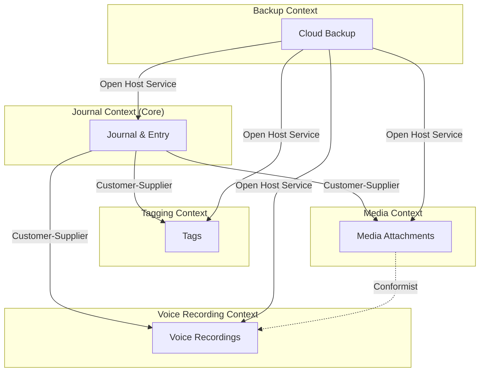

# Context Map — LifeLogr

## Bounded Context Diagram

---

## Integration Patterns

### Journal → Tagging: Customer-Supplier
Journal entries are the upstream supplier of identity (entry IDs) that tags depend on. When an entry is deleted, the tagging context must conform by removing associations. Journal controls the contract; tagging adapts.

### Journal → Media: Customer-Supplier
Media attachments cannot exist without a parent entry. The Journal context supplies entry identity and lifecycle events; the Media context attaches files in response. Entry deletion triggers cascade cleanup.

### Journal → Voice Recording: Customer-Supplier
Voice recordings are anchored to entries the same way media is. The Journal context owns the entry lifecycle; recordings respond to it. This mirrors the Media relationship.

### Media → Voice Recording: Conformist
Voice Recording is a specialised subdomain of Media. It conforms entirely to the Media context's attachment model, adding audio-specific fields (duration, transcription) without altering the base contract. No translation layer needed.

### Backup → All Contexts: Open Host Service
The Backup context reads from all other contexts to produce incremental snapshots and writes back during restore. Each context exposes a well-defined data contract that Backup consumes. Backup does not drive domain logic; it is a cross-cutting infrastructure concern.

---

## Context Summary Table

| Context | Type | Upstream | Pattern | Justification |
|---------|------|----------|---------|---------------|
| Journal | Core | — | — | Root domain; owns entry lifecycle |
| Tagging | Supporting | Journal | Customer-Supplier | Tags depend on entry lifecycle; journal dictates when associations are removed |
| Media | Supporting | Journal | Customer-Supplier | Media is owned by entries and cascades on deletion |
| Voice Recording | Supporting | Journal, Media | Customer-Supplier, Conformist | Recordings are entry-scoped (like media) and conform to the media attachment contract |
| Backup | Generic | Journal, Tagging, Media, Voice | Open Host Service | Backup reads standardised contracts from all contexts for incremental snapshot/restore |
