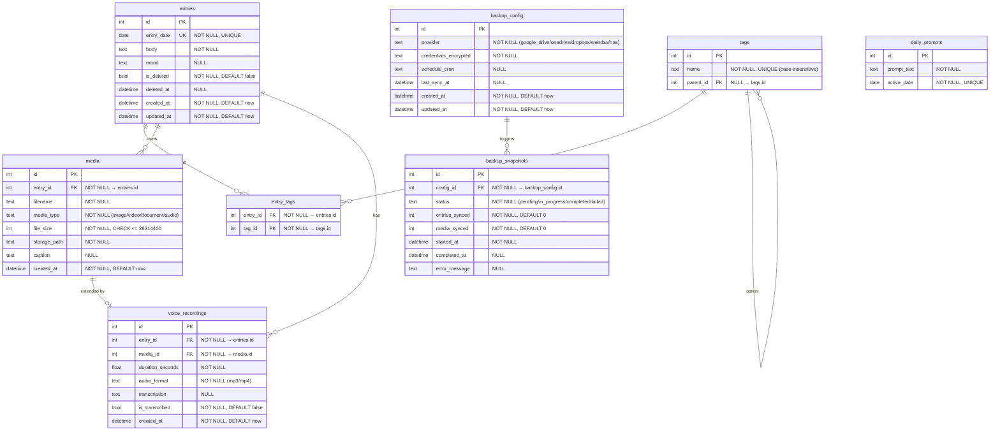

# Technical Specification — Diarilinux

> Phase 2: API-level specification derived from [REQUIREMENTS.md](../01-requirements/REQUIREMENTS.md).
> Stack: FastAPI, SQLAlchemy 2.x (mapped dataclasses), Pydantic v2, SQLite.

---

## Data Model

### ER Diagram



### Column Notes

- All `id` columns are auto-increment integers.
- `entry_date` uses a SQLite `DATE` affinity stored as ISO-8601 string (`YYYY-MM-DD`).
- `credentials_encrypted` stores AES-256-GCM encrypted JSON.
- `file_size` CHECK constraint enforces the 25 MB (26,214,400 bytes) limit at the DB level.
- `entry_tags` has a composite primary key `(entry_id, tag_id)`.
- `tags.name` has a UNIQUE index with `COLLATE NOCASE` for case-insensitive uniqueness.

---

## Pydantic Schemas (v2)

### Entries

```python
class EntryCreate(BaseModel):
    """Schema for creating a new journal entry."""
    entry_date: date
    body: str = Field(min_length=1, description="Markdown body; may be empty if media attached later")
    mood: str | None = Field(default=None, max_length=50, description="Mood label (e.g. happy, sad, anxious)")
    tag_ids: list[int] = Field(default_factory=list, description="IDs of tags to associate")

    model_config = ConfigDict(json_schema_extra={
        "example": {
            "entry_date": "2026-05-08",
            "body": "Today I started building my journal app.",
            "mood": "excited",
            "tag_ids": [1, 3]
        }
    })


class EntryUpdate(BaseModel):
    """Schema for updating an existing journal entry."""
    body: str | None = Field(default=None, min_length=1, description="Updated Markdown body")
    mood: str | None = Field(default=None, max_length=50, description="Updated mood label; set to null to clear")

    model_config = ConfigDict(json_schema_extra={
        "example": {
            "body": "Updated thoughts for today.",
            "mood": "calm"
        }
    })


class EntryResponse(BaseModel):
    """Schema returned for a single journal entry."""
    id: int
    entry_date: date
    body: str
    mood: str | None
    is_deleted: bool
    tags: list["TagBrief"]
    media_count: int
    has_recording: bool
    created_at: datetime
    updated_at: datetime

    model_config = ConfigDict(from_attributes=True)


class EntryListResponse(BaseModel):
    """Paginated list of entries."""
    items: list[EntryResponse]
    total: int
    offset: int
    limit: int
```

### Tags

```python
class TagCreate(BaseModel):
    """Schema for creating a new tag."""
    name: str = Field(min_length=1, max_length=100, description="Tag name; case-insensitive unique")
    parent_id: int | None = Field(default=None, description="Parent tag ID for hierarchy")

    model_config = ConfigDict(json_schema_extra={
        "example": {"name": "europe", "parent_id": 5}
    })


class TagUpdate(BaseModel):
    """Schema for renaming a tag."""
    name: str = Field(min_length=1, max_length=100, description="New tag name")


class TagBrief(BaseModel):
    """Minimal tag info embedded in entry responses."""
    id: int
    name: str

    model_config = ConfigDict(from_attributes=True)


class TagResponse(BaseModel):
    """Full tag with hierarchy info."""
    id: int
    name: str
    parent_id: int | None
    children: list[TagBrief]
    entry_count: int

    model_config = ConfigDict(from_attributes=True)
```

### Media

```python
class MediaCreate(BaseModel):
    """Upload metadata (file sent as multipart/form-data)."""
    entry_id: int = Field(description="Entry to attach media to")
    caption: str | None = Field(default=None, max_length=500, description="Optional caption")


class MediaResponse(BaseModel):
    """Schema returned for a single media attachment."""
    id: int
    entry_id: int
    filename: str
    media_type: str
    file_size: int
    caption: str | None
    created_at: datetime

    model_config = ConfigDict(from_attributes=True)
```

### Voice Recordings

```python
class VoiceRecordingResponse(BaseModel):
    """Schema returned for a voice recording."""
    id: int
    entry_id: int
    media_id: int
    duration_seconds: float
    audio_format: str
    transcription: str | None
    is_transcribed: bool
    created_at: datetime

    model_config = ConfigDict(from_attributes=True)


class TranscriptionRequest(BaseModel):
    """Trigger transcription for a recording."""
    recording_id: int
```

### Backup

```python
class BackupConfigCreate(BaseModel):
    """Schema for setting up a cloud backup provider."""
    provider: str = Field(description="One of: google_drive, onedrive, dropbox, webdav, nas")
    credentials: dict[str, str] = Field(description="Provider-specific credential map")
    schedule_cron: str | None = Field(default=None, description="Cron expression for auto-backup")

    model_config = ConfigDict(json_schema_extra={
        "example": {
            "provider": "webdav",
            "credentials": {"url": "https://dav.example.com", "username": "user", "password": "***"},
            "schedule_cron": "0 3 * * *"
        }
    })


class BackupConfigResponse(BaseModel):
    """Schema returned for a backup configuration."""
    id: int
    provider: str
    schedule_cron: str | None
    last_sync_at: datetime | None
    created_at: datetime
    updated_at: datetime

    model_config = ConfigDict(from_attributes=True)


class BackupSnapshotResponse(BaseModel):
    """Schema returned for a backup run."""
    id: int
    config_id: int
    status: str
    entries_synced: int
    media_synced: int
    started_at: datetime
    completed_at: datetime | None
    error_message: str | None

    model_config = ConfigDict(from_attributes=True)


class RestoreRequest(BaseModel):
    """Trigger a restore from the latest backup."""
    config_id: int
```

---

## API Contract

### Auth Scheme

**None for local endpoints.** The app is single-user and offline-first (NFR-001, NFR-006). All journal, tag, media, and voice endpoints are unauthenticated.

Backup endpoints that interact with cloud providers validate provider credentials stored in `backup_config` — no app-level auth is required.

### Pagination

All list endpoints use **offset pagination**:

| Parameter | Type | Default | Description |
|-----------|------|---------|-------------|
| `offset` | int | 0 | Number of items to skip |
| `limit` | int | 20 | Items per page (max 100) |

Response shape: `{ items: [...], total: int, offset: int, limit: int }`

---

### Journal Endpoints

| Method | Path | Summary |
|--------|------|---------|
| POST | `/api/v1/entries` | Create a new entry |
| GET | `/api/v1/entries` | List entries (paginated) |
| GET | `/api/v1/entries/{entry_id}` | Get a single entry |
| PATCH | `/api/v1/entries/{entry_id}` | Update an entry |
| DELETE | `/api/v1/entries/{entry_id}` | Soft-delete an entry |
| GET | `/api/v1/entries/calendar/{year}/{month}` | Calendar view for a month |
| GET | `/api/v1/entries/search` | Full-text search |

#### `POST /api/v1/entries`
- **Request:** `EntryCreate`
- **Response:** `EntryResponse` — 201 Created
- **Errors:**
  - 409 Conflict — entry already exists for `entry_date`
  - 422 Unprocessable Entity — validation failure

#### `GET /api/v1/entries`
- **Query params:** `offset`, `limit`, `tag_ids` (comma-separated, optional), `mood` (optional), `year` (optional), `month` (optional)
- **Response:** `EntryListResponse` — 200 OK
- **Errors:** 422 — invalid query params

#### `GET /api/v1/entries/{entry_id}`
- **Response:** `EntryResponse` — 200 OK
- **Errors:** 404 Not Found

#### `PATCH /api/v1/entries/{entry_id}`
- **Request:** `EntryUpdate`
- **Response:** `EntryResponse` — 200 OK
- **Errors:** 404 Not Found, 422 — validation failure

#### `DELETE /api/v1/entries/{entry_id}`
- **Response:** 204 No Content
- **Side effects:** Sets `is_deleted=true`, `deleted_at=now()`. Cascades media deletion (FR-016).
- **Errors:** 404 Not Found

#### `GET /api/v1/entries/calendar/{year}/{month}`
- **Path params:** `year` (int), `month` (int 1-12)
- **Response:** `list[EntryResponse]` — entries for the given month, ordered by date
- **Errors:** 422 — invalid year/month

#### `GET /api/v1/entries/search`
- **Query params:** `q` (str, required), `offset`, `limit`
- **Response:** `EntryListResponse` — 200 OK, full-text search on `body`
- **Errors:** 422 — missing `q` param

---

### Tag Endpoints

| Method | Path | Summary |
|--------|------|---------|
| POST | `/api/v1/tags` | Create a tag |
| GET | `/api/v1/tags` | List all tags (tree) |
| GET | `/api/v1/tags/{tag_id}` | Get a single tag |
| PATCH | `/api/v1/tags/{tag_id}` | Rename a tag |
| DELETE | `/api/v1/tags/{tag_id}` | Delete a tag |

#### `POST /api/v1/tags`
- **Request:** `TagCreate`
- **Response:** `TagResponse` — 201 Created
- **Errors:**
  - 409 Conflict — tag name already exists (case-insensitive)
  - 422 — validation failure

#### `GET /api/v1/tags`
- **Query params:** `parent_id` (optional, filter to children of a tag)
- **Response:** `list[TagResponse]` — 200 OK, hierarchical tree if `parent_id` is omitted

#### `GET /api/v1/tags/{tag_id}`
- **Response:** `TagResponse` — 200 OK
- **Errors:** 404 Not Found

#### `PATCH /api/v1/tags/{tag_id}`
- **Request:** `TagUpdate`
- **Response:** `TagResponse` — 200 OK
- **Errors:** 404 Not Found, 409 Conflict, 422

#### `DELETE /api/v1/tags/{tag_id}`
- **Response:** 204 No Content
- **Side effects:** Removes all `entry_tags` associations for this tag
- **Errors:** 404 Not Found

---

### Media Endpoints

| Method | Path | Summary |
|--------|------|---------|
| POST | `/api/v1/media` | Upload media file |
| GET | `/api/v1/media/{media_id}` | Get media metadata |
| GET | `/api/v1/media/{media_id}/file` | Download media file |
| DELETE | `/api/v1/media/{media_id}` | Delete media |

#### `POST /api/v1/media`
- **Request:** `multipart/form-data` — file + `MediaCreate` fields
- **Response:** `MediaResponse` — 201 Created
- **Errors:**
  - 400 Bad Request — file exceeds 25 MB
  - 404 Not Found — `entry_id` does not exist
  - 422 — validation failure

#### `GET /api/v1/media/{media_id}`
- **Response:** `MediaResponse` — 200 OK
- **Errors:** 404 Not Found

#### `GET /api/v1/media/{media_id}/file`
- **Response:** Binary file stream — 200 OK with `Content-Type` and `Content-Disposition`
- **Errors:** 404 Not Found

#### `DELETE /api/v1/media/{media_id}`
- **Response:** 204 No Content
- **Side effects:** Removes file from disk, deletes DB row
- **Errors:** 404 Not Found

---

### Voice Recording Endpoints

| Method | Path | Summary |
|--------|------|---------|
| POST | `/api/v1/recordings` | Upload a voice recording |
| POST | `/api/v1/recordings/{recording_id}/transcribe` | Transcribe a recording |
| GET | `/api/v1/recordings/{recording_id}` | Get recording metadata |
| DELETE | `/api/v1/recordings/{recording_id}` | Delete a recording |

#### `POST /api/v1/recordings`
- **Request:** `multipart/form-data` — audio file + `entry_id` (int)
- **Response:** `VoiceRecordingResponse` — 201 Created
- **Errors:**
  - 400 Bad Request — file exceeds 25 MB or unsupported format
  - 404 Not Found — `entry_id` does not exist
  - 422 — validation failure

#### `POST /api/v1/recordings/{recording_id}/transcribe`
- **Request:** empty body
- **Response:** `VoiceRecordingResponse` — 200 OK (with populated `transcription`)
- **Side effects:** Runs local speech-to-text; appends transcription to entry body
- **Errors:**
  - 404 Not Found
  - 409 Conflict — already transcribed
  - 500 Internal Server Error — transcription engine failure

#### `GET /api/v1/recordings/{recording_id}`
- **Response:** `VoiceRecordingResponse` — 200 OK
- **Errors:** 404 Not Found

#### `DELETE /api/v1/recordings/{recording_id}`
- **Response:** 204 No Content
- **Side effects:** Deletes associated media and audio file
- **Errors:** 404 Not Found

---

### Backup Endpoints

| Method | Path | Summary |
|--------|------|---------|
| POST | `/api/v1/backup/config` | Create/update backup config |
| GET | `/api/v1/backup/config` | Get current backup config |
| POST | `/api/v1/backup/config/{config_id}/test` | Test cloud connection |
| POST | `/api/v1/backup/run` | Trigger incremental backup |
| GET | `/api/v1/backup/snapshots` | List backup snapshots |
| POST | `/api/v1/backup/restore` | Restore from backup |

#### `POST /api/v1/backup/config`
- **Request:** `BackupConfigCreate`
- **Response:** `BackupConfigResponse` — 201 Created
- **Errors:** 422 — invalid provider or credentials format

#### `GET /api/v1/backup/config`
- **Response:** `list[BackupConfigResponse]` — 200 OK

#### `POST /api/v1/backup/config/{config_id}/test`
- **Response:** `{ "success": true, "message": "Connection OK" }` — 200 OK
- **Errors:** 400 Bad Request — connection failed, 404 Not Found

#### `POST /api/v1/backup/run`
- **Request:** `{ "config_id": int }`
- **Response:** `BackupSnapshotResponse` — 202 Accepted
- **Errors:** 404 Not Found — config does not exist, 409 Conflict — backup already in progress

#### `GET /api/v1/backup/snapshots`
- **Query params:** `offset`, `limit`, `config_id` (optional)
- **Response:** `{ items: list[BackupSnapshotResponse], total: int, offset: int, limit: int }` — 200 OK

#### `POST /api/v1/backup/restore`
- **Request:** `RestoreRequest`
- **Response:** `{ "success": true, "entries_restored": int, "media_restored": int }` — 200 OK
- **Side effects:** Atomic replace of local data (FR-022)
- **Errors:**
  - 404 Not Found — config does not exist
  - 409 Conflict — no backup data available
  - 500 Internal Server Error — restore failed, rolled back

---

### Daily Prompt Endpoint

| Method | Path | Summary |
|--------|------|---------|
| GET | `/api/v1/prompts/today` | Get today's prompt |

#### `GET /api/v1/prompts/today`
- **Response:** `{ "id": int, "prompt_text": str, "active_date": date }` — 200 OK
- **Errors:** 404 Not Found — no prompt for today

---

## Service Layer Interfaces

### `EntryService`

```python
class EntryService:
    def create(self, data: EntryCreate) -> Entry:
        """Create a new journal entry for a date; reject if date is taken."""

    def get(self, entry_id: int) -> Entry:
        """Return a single non-deleted entry by ID."""

    def list_entries(self, offset: int, limit: int, tag_ids: list[int] | None = None,
                     mood: str | None = None, year: int | None = None,
                     month: int | None = None) -> tuple[list[Entry], int]:
        """Return paginated entries matching optional filters and total count."""

    def update(self, entry_id: int, data: EntryUpdate) -> Entry:
        """Update body and/or mood of an existing entry."""

    def soft_delete(self, entry_id: int) -> None:
        """Mark entry as deleted; cascade-remove media files."""

    def get_calendar_month(self, year: int, month: int) -> list[Entry]:
        """Return all non-deleted entries for a given month."""

    def search(self, query: str, offset: int, limit: int) -> tuple[list[Entry], int]:
        """Full-text search on entry body; return matches and total count."""
```

### `TagService`

```python
class TagService:
    def create(self, data: TagCreate) -> Tag:
        """Create a tag; reject duplicate names (case-insensitive)."""

    def get(self, tag_id: int) -> Tag:
        """Return a single tag with children and entry count."""

    def list_tree(self, parent_id: int | None = None) -> list[Tag]:
        """Return tag hierarchy; full tree or children of a parent."""

    def rename(self, tag_id: int, data: TagUpdate) -> Tag:
        """Rename a tag; reject duplicate names."""

    def delete(self, tag_id: int) -> None:
        """Delete tag and remove all entry associations."""

    def associate(self, entry_id: int, tag_ids: list[int]) -> None:
        """Associate tags with an entry; skip already-associated."""

    def dissociate(self, entry_id: int, tag_ids: list[int]) -> None:
        """Remove tag associations from an entry."""
```

### `MediaService`

```python
class MediaService:
    def upload(self, entry_id: int, filename: str, content_type: str,
               file_data: bytes, caption: str | None = None) -> Media:
        """Store file on disk and create media record; reject > 25 MB."""

    def get(self, media_id: int) -> Media:
        """Return media metadata."""

    def get_file(self, media_id: int) -> tuple[bytes, str, str]:
        """Return (file_bytes, content_type, filename) from disk."""

    def delete(self, media_id: int) -> None:
        """Delete media record and remove file from disk."""

    def delete_by_entry(self, entry_id: int) -> None:
        """Delete all media for an entry (cascade on soft-delete)."""
```

### `VoiceRecordingService`

```python
class VoiceRecordingService:
    def upload(self, entry_id: int, filename: str,
               file_data: bytes) -> VoiceRecording:
        """Store audio file, create media + recording records."""

    def get(self, recording_id: int) -> VoiceRecording:
        """Return recording metadata."""

    def transcribe(self, recording_id: int) -> VoiceRecording:
        """Run local speech-to-text; append transcription to entry body."""

    def delete(self, recording_id: int) -> None:
        """Delete recording and associated media."""
```

### `BackupService`

```python
class BackupService:
    def create_config(self, data: BackupConfigCreate) -> BackupConfig:
        """Encrypt and store cloud provider credentials."""

    def get_configs(self) -> list[BackupConfig]:
        """Return all backup configurations."""

    def test_connection(self, config_id: int) -> bool:
        """Validate stored credentials by connecting to the provider."""

    def run_backup(self, config_id: int) -> BackupSnapshot:
        """Perform incremental backup; transfer new/modified data since last sync."""

    def list_snapshots(self, config_id: int | None, offset: int,
                       limit: int) -> tuple[list[BackupSnapshot], int]:
        """Return paginated backup history."""

    def restore(self, config_id: int) -> dict[str, int]:
        """Atomically replace local data with cloud backup; rollback on failure."""
```

### `PromptService`

```python
class PromptService:
    def get_today(self) -> DailyPrompt:
        """Return today's writing prompt; raise if none exists."""
```

---

## Traceability Matrix

| Spec Item | FR / NFR | Priority |
|-----------|----------|----------|
| `entries` table, `EntryCreate`, `POST /entries` | FR-001 | MUST |
| `EntryUpdate`, `PATCH /entries/{id}` | FR-002 | MUST |
| `is_deleted` flag, `DELETE /entries/{id}` | FR-003 | MUST |
| `GET /entries`, `GET /entries/calendar/{y}/{m}`, `GET /entries/search` | FR-004 | MUST |
| `body` as Markdown text field | FR-005 | MUST |
| `daily_prompts` table, `GET /prompts/today` | FR-006 | SHOULD |
| `mood` column on `entries`, `EntryCreate.mood` | FR-007 | SHOULD |
| `POST /tags` | FR-008 | MUST |
| `tags.parent_id` FK, `GET /tags` tree response | FR-009 | MUST |
| `entry_tags` join table, `EntryCreate.tag_ids` | FR-010 | MUST |
| `DELETE /tags/{id}`, cascade on `entry_tags` | FR-011 | MUST |
| `GET /entries?tag_ids=...` | FR-012 | MUST |
| `POST /media`, multipart upload | FR-013 | MUST |
| `GET /media/{id}/file` | FR-014 | MUST |
| `DELETE /media/{id}` | FR-015 | MUST |
| `EntryService.soft_delete` → `MediaService.delete_by_entry` | FR-016 | MUST |
| `POST /recordings`, audio upload | FR-017 | MUST |
| `POST /recordings/{id}/transcribe`, local STT | FR-018 | MUST |
| `POST /backup/config`, encrypted credentials | FR-019 | MUST |
| `BackupConfigCreate.provider` enum | FR-020 | MUST |
| `BackupService.run_backup`, incremental sync | FR-021 | MUST |
| `POST /backup/restore`, atomic replace | FR-022 | MUST |
| `BackupConfigCreate.schedule_cron` | FR-023 | SHOULD |
| All CRUD on local SQLite | NFR-001 | MUST |
| Offset pagination, indexed queries | NFR-002 | MUST |
| `is_deleted` + `deleted_at`, 30-day retention | NFR-003 | MUST |
| `file_size` CHECK ≤ 25 MB, `body` min_length=1 | NFR-004 | MUST |
| `credentials_encrypted`, AES-256-GCM | NFR-005 | MUST |
| No auth middleware, single-user assumption | NFR-006 | SHOULD |
| SQLite file-based storage | NFR-007 | SHOULD |
| Markdown rendering, semantic HTML | NFR-008 | COULD |
