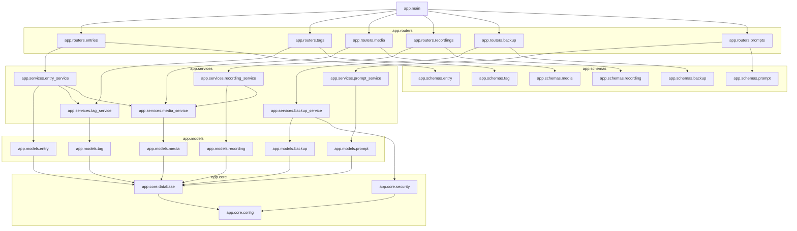
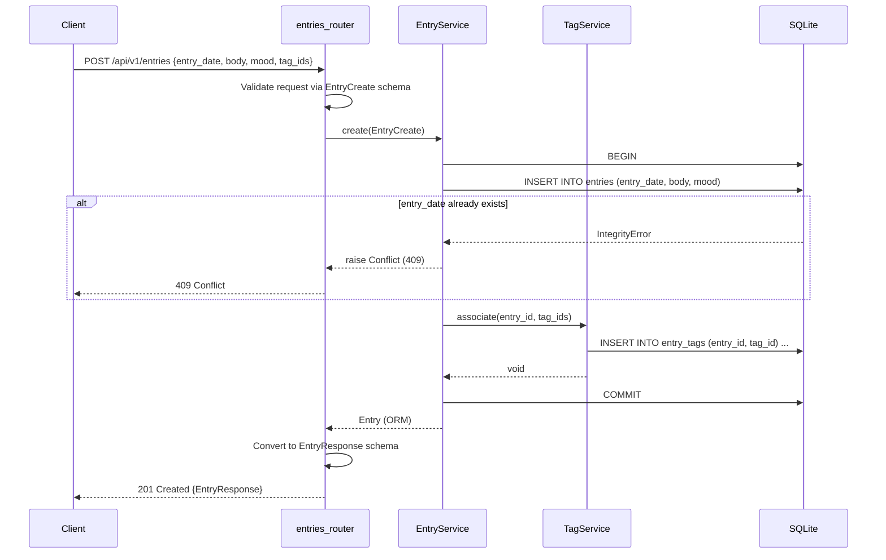
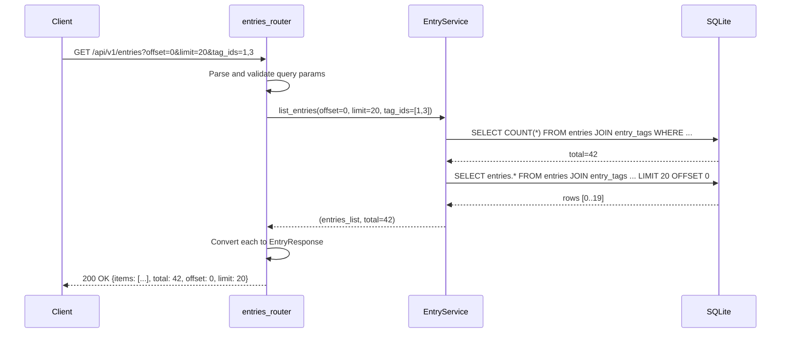
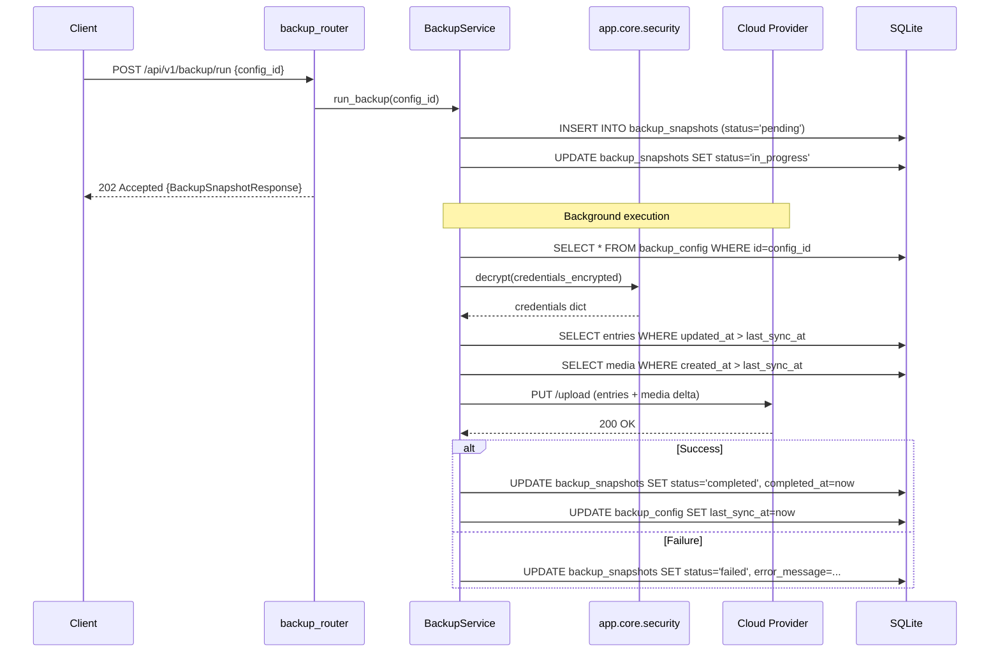

# Architecture Design — Diarilinux

> Phase 4: Design derived from [SPEC.md](../02-spec/SPEC.md) and [REVIEW.md](../03-review/REVIEW.md) (PASS).
> Stack: FastAPI, SQLAlchemy 2.x, Pydantic v2, SQLite, `uv`.

---

## Component Diagram



### Import Rules

| From | To | Allowed |
|------|----|---------|
| `app.main` | `app.routers.*`, `app.core.*` | Yes |
| `app.routers.*` | `app.services.*`, `app.schemas.*` | Yes |
| `app.routers.*` | `app.models.*` | **No** — go through services |
| `app.services.*` | `app.models.*`, `app.core.*` | Yes |
| `app.services.*` | `app.schemas.*` | **No** — services return ORM objects; routers convert to schemas |
| `app.models.*` | `app.core.database` | Yes (Base, engine import) |
| `app.schemas.*` | anything | **No** — pure Pydantic, no imports from other app layers |

---

## Sequence Diagrams

### 1. Write Operation — Create Entry with Tags



### 2. Paginated List Query — Browse Entries



### 3. Background Task — Incremental Backup



---

## Module File Map

```
backend/app/
├── main.py                          # FastAPI app factory, router registration, CORS
├── core/
│   ├── __init__.py
│   ├── config.py                    # Settings via pydantic-settings (DATABASE_URL, MEDIA_DIR, etc.)
│   ├── database.py                  # SQLAlchemy async engine, sessionmaker, Base
│   └── security.py                  # AES-256-GCM encrypt/decrypt for credentials
├── routers/
│   ├── __init__.py
│   ├── entries.py                   # Journal CRUD + calendar + search
│   ├── tags.py                      # Tag CRUD + tree
│   ├── media.py                     # Media upload/download/delete
│   ├── recordings.py                # Voice recording upload/transcribe/delete
│   ├── backup.py                    # Backup config, run, restore, snapshots
│   └── prompts.py                   # Daily prompt
├── models/
│   ├── __init__.py                  # Re-export all models for Alembic discovery
│   ├── entry.py                     # Entry ORM
│   ├── tag.py                       # Tag + EntryTag ORM
│   ├── media.py                     # Media ORM
│   ├── recording.py                 # VoiceRecording ORM
│   ├── backup.py                    # BackupConfig + BackupSnapshot ORM
│   └── prompt.py                    # DailyPrompt ORM
├── schemas/
│   ├── __init__.py
│   ├── entry.py                     # EntryCreate, EntryUpdate, EntryResponse, EntryListResponse
│   ├── tag.py                       # TagCreate, TagUpdate, TagBrief, TagResponse
│   ├── media.py                     # MediaCreate, MediaResponse
│   ├── recording.py                 # VoiceRecordingResponse, TranscriptionRequest
│   ├── backup.py                    # BackupConfigCreate/Response, BackupSnapshotResponse, RestoreRequest
│   └── prompt.py                    # PromptResponse
└── services/
    ├── __init__.py
    ├── entry_service.py
    ├── tag_service.py
    ├── media_service.py
    ├── recording_service.py
    ├── backup_service.py
    └── prompt_service.py
```

---

## Key Design Decisions

| Decision | Choice | Rationale |
|----------|--------|-----------|
| DB sessions | Per-request `Depends(get_db)` via FastAPI dependency injection | Ensures clean session lifecycle; auto-closes on response |
| ORM style | SQLAlchemy 2.x mapped dataclasses (`DeclarativeBase`) | Type-safe, IDE-friendly, matches SPEC requirement |
| File storage | Local filesystem under `MEDIA_DIR` with UUID filenames | Simple, portable, avoids DB bloat; path stored in `media.storage_path` |
| Backup execution | `BackgroundTasks` from FastAPI | Single-user app; no need for Celery/Redis. Backup runs in-process |
| Transcription | `whisper` (OpenAI local model) via subprocess | Runs on-device, no API key needed, matches FR-018 |
| Encryption | AES-256-GCM via `cryptography` library | Standard, audited, matches NFR-005 |
| Error handling | Service layer raises domain exceptions; routers catch and map to HTTP | Clean separation; services never import FastAPI |
| Config | `pydantic-settings` reading `.env` | Type-safe config with validation, matches CLAUDE.md convention |

---

## Dependency Injection

```python
# app/core/database.py
async def get_db() -> AsyncGenerator[AsyncSession, None]:
    async with async_session() as session:
        yield session

# app/routers/entries.py
@router.post("/api/v1/entries", response_model=EntryResponse, status_code=201)
async def create_entry(data: EntryCreate, db: AsyncSession = Depends(get_db)):
    svc = EntryService(db)
    entry = await svc.create(data)
    return entry
```

Services are instantiated per-request with the injected session. No global singletons.

---

## Directory Layout for Media Storage

```
MEDIA_DIR/
├── images/
│   └── {uuid}.{ext}
├── videos/
│   └── {uuid}.{ext}
├── audio/
│   └── {uuid}.{ext}
└── documents/
    └── {uuid}.{ext}
```

Files are named by UUID to avoid collisions. Original filename preserved in `media.filename`. `media.storage_path` stores the relative path from `MEDIA_DIR`.

---

## Error Mapping Strategy

```python
# app/core/exceptions.py
class NotFoundError(Exception): ...
class ConflictError(Exception): ...
class ValidationError(Exception): ...
class MediaSizeError(Exception): ...

# app/main.py — global exception handlers
@app.exception_handler(NotFoundError)
async def not_found_handler(request, exc):
    return JSONResponse(status_code=404, content={"detail": str(exc)})

@app.exception_handler(ConflictError)
async def conflict_handler(request, exc):
    return JSONResponse(status_code=409, content={"detail": str(exc)})
```

Services raise domain exceptions. Routers don't need try/except — the global handlers map them to HTTP responses.

---

## Review Minor Fixes Incorporated

| Minor | Design resolution |
|-------|-------------------|
| 001 — GET /tags errors | Invalid `parent_id` returns empty list (no 404 needed for optional filter) |
| 002 — GET /backup/snapshots errors | FastAPI auto-validates offset/limit → 422; invalid `config_id` returns empty list |
| 003 — credentials as dict | Kept as `dict[str, str]` — provider credential schemas differ too much to union; validation happens in service layer per-provider |
| 004 — missing pagination notes | Tree/calendar are bounded; documented in DESIGN |
| 005 — missing examples | Will be added during implementation (p5) |
| 006 — no out-of-scope section | Linked from REQUIREMENTS.md; not duplicated in design |

---

## Future Performance & Reliability Enhancements

To sustain single-user scaling and local ML inference throughput, the following architectural upgrades are slated for implementation:

### 1. Concurrency Optimization in Inference Services
*   **Target:** `VoiceRecordingService._run_stt`, `OCRService.extract_text`, and `VideoService.transcribe`.
*   **Resolution:** Offload CPU-intensive operations (Whisper transcription, Tesseract process execution) from the main ASGI thread to a separate threadpool using `asyncio.to_thread`. This guarantees that long-running inferences will not block FastAPI's primary event loop.

### 2. Video STT Memory Management
*   **Target:** `VideoService.transcribe`.
*   **Resolution:** Refactor `VoiceRecordingService` to accept file paths directly, avoiding loading raw video files (often exceeding 100MB+) into active RAM as `bytes`.

### 3. Filter Propagation to Vector Indexes
*   **Target:** `SearchService._semantic_search`.
*   **Resolution:** Integrate SQL filter generators directly into the SQL select statements preceding embedding computations. Instead of running full in-memory cosine similarity comparisons across the entire database, pre-filtering by tags, mood, or dates will narrow down candidates significantly.

### 4. Connection Pool Audits
*   **Target:** `NextcloudProvider` and `GoogleDriveProvider`.
*   **Resolution:** Expand `SyncProvider` with an explicit `close()` protocol method, and utilize context manager lifecycles inside orchestration routines to cleanly tear down shared `httpx.AsyncClient` socket connection pools.

